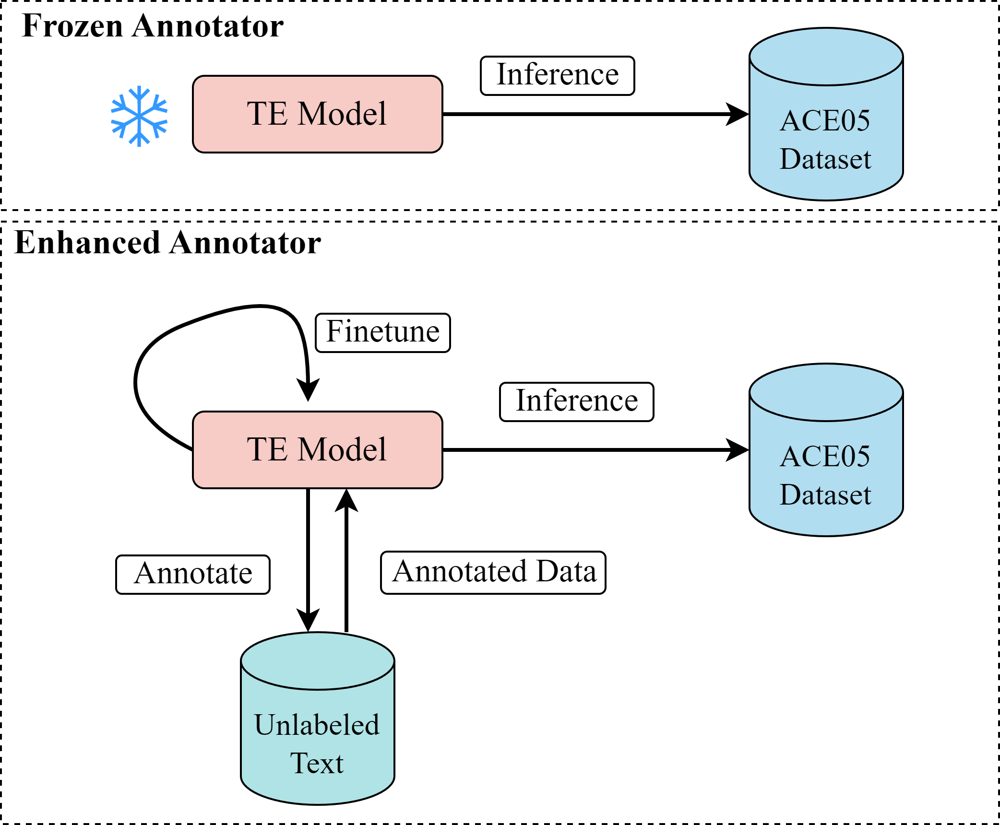
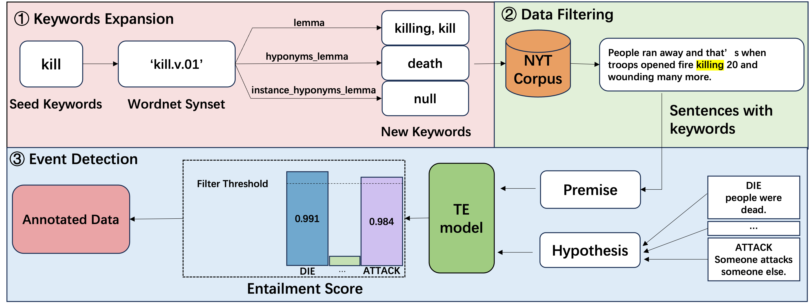

# Zero-shot Event Detection using a Textual Entailment Model as an Enhanced Annotator

Source code for LREC-COLING 2024 paper titled "[Zero-shot Event Detection using a Textual Entailment Model as an Enhanced Annotator]()".
<div align="center">
  
</div>

Figure 1: The illustration of the difference between a textual entailment model as a frozen annotator and an enhanced annotator.

<div align="center">
  
</div>

Figure 2: The general workflow of using a pre-trained TE model and keyword expansion to annotate unlabeled data.

- We propose to use a TE(Textual Entailment) model to annotate large-scale unlabeled text and use annotated data to finetune the TE model, yielding an improved TE model.
- We propose to use keywords to filter out sentences with a low probability of expressing event(s).
- We expand limited number of seed keywords using WordNet, so that we can use the TE model to annotate unlabeled text efficiently.  
- The experimental results show that our method can outperform other baselines by 15% on the ACE05 dataset.

## Requirements
Install the necessary packages with: 
```
$ pip install -r requirements.txt
```

## Usage

- To finetune the TE model 

​	```cd ZS_TE/train_te_model```

​	You may modify the  arguments in ```fine_tune.py```

​	```python fine_tune.py```

- To do the event detection task

​	```cd ZS_TE/predict_event```

​	You may modify the  arguments in ```pred(smoothing).py```

​	```python pred(smoothing).py```

- To do the trigger classification task

​	```cd ZS_TE/bert_classification```

​	You may modify the  arguments in ```bert_c.py``` and  ```dataset.py```

​	```python bert_c.py```
